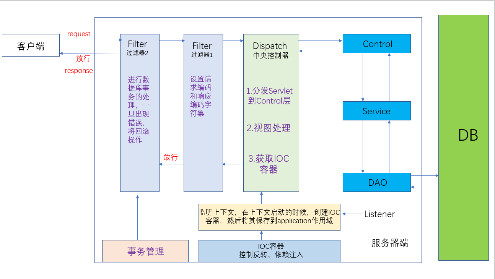
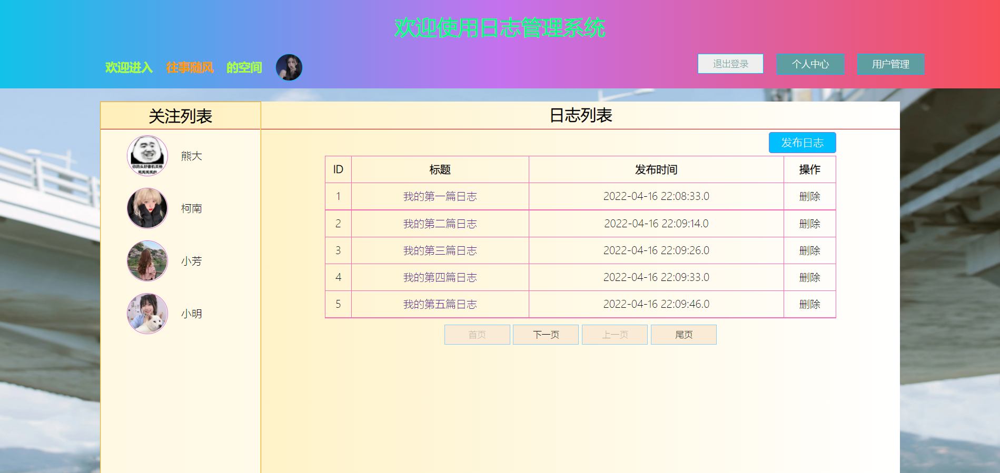
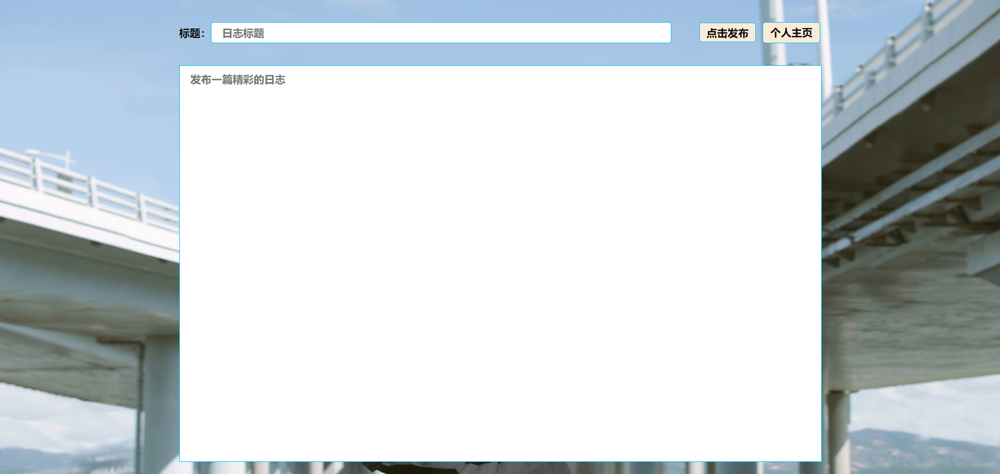
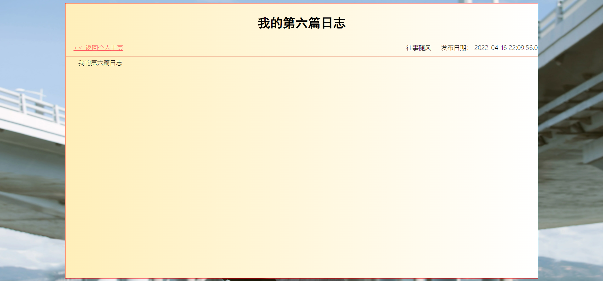
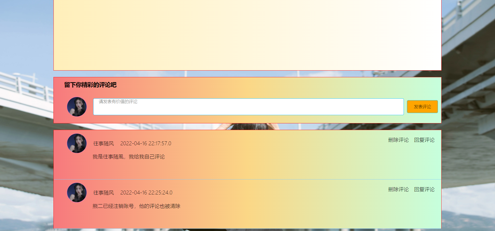
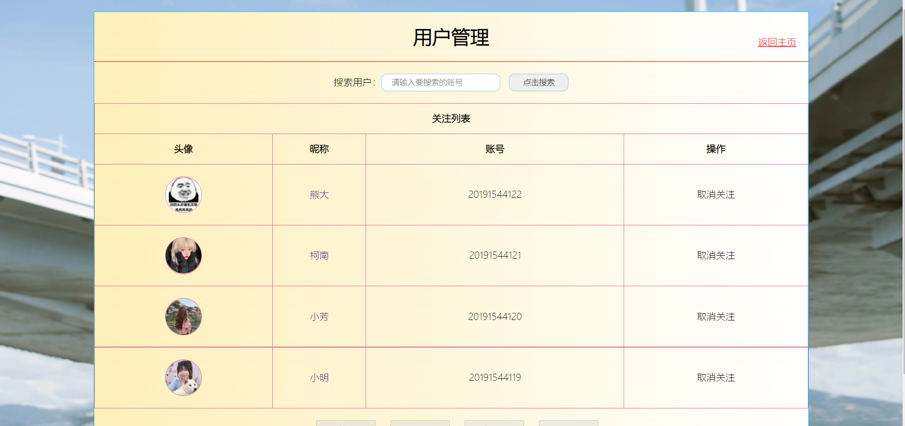
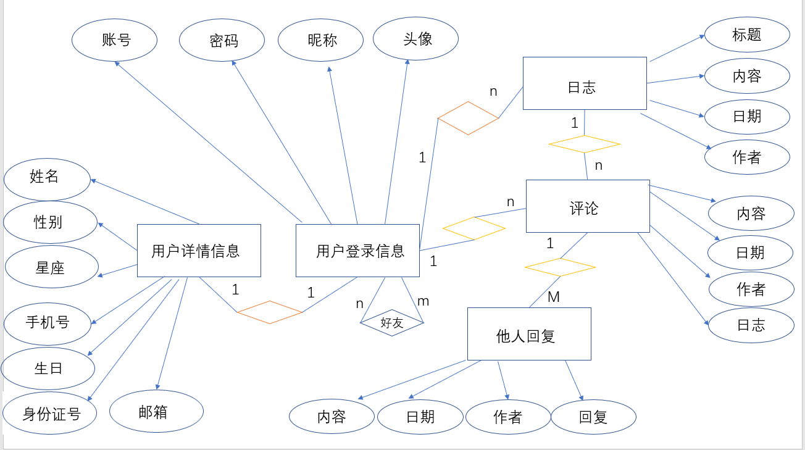

# TopicZone开发文档


## 一、 业务需求

* 用户登录
  * 登录成功，显示主界面。
* 用户注册
  * 如果没有账号则进入登录界面

* 忘记密码
  * 通过手机号找回密码

* 主界面
  * 登录成功后进入主界面
  * 左侧显示好友列表
    * 通过点击好友昵称，进入好友空间

  * 上端显示欢迎词和子级功能按键，如果不是自己的空间，则显示超链接，返回自己的空间；
  * 右侧显示日志列表
    * 日志列表采用分页形式展示，每五条记录为一次展示
    * 点击日志名称，进入日志详情界面
    * 点击删除选项，可以删除对应日志
    * 点击发布按钮，发布日志
    
  * 子级菜单
    * 退出登录
    * 个人中心
      * 可以设置自己的详细信息
      * 可以注销当前账号（注销后将清空账户所有信息，包括日志、评论、个人详细信息等）
      * 返回个人主页
      
    * 用户管理
      * 可以根据账号检索所有用户
      * 可以关注指定用户和取消关注
      * 关注列表分页展示
      * 用户列表分页展示
      * 点击用户昵称，进入用户主页
      * 点击关注用户昵称，进入关注用户主页
  
* 查看日志详情：
  * 日志本身的信息（作者头像、昵称、日志标题、日志内容、日志的日期）
  * 回复列表（回复者的头像、昵称、恢复内容、恢复日期）
  * 作者回复信息（回复者的头像、昵称、恢复内容、恢复日期）
* 发布日志、发布评论、发布评论回复
* 删除日志、删除评论、删除评论回复


## 二、用到的技术栈

* **开发工具**
  * IDEA
  * SQLyog
  * jdk1.8
  * Chrome浏览器

* **后端**
  * javaSE
  * JDBC
  * MySQL8.0
  * Tomcat8.5.76
  * IOC
  * MVC
  * Thymeleaf
  
* **前端**
  * JavaScript
  * HTML
  * CSS


## 三、底层逻辑结构




## 四、页面展示

* 登录菜单界面


* 注册界面


* 主页



* 发布日志界面



* 日志详情界面





* 用户管理界面




* 个人中心界面


## 五、运行结果展示

[个人日志系统功能在线演示（哔哩哔哩）](https://www.bilibili.com/video/BV1fi4y1U7cq/)


[更多细节请访问我的博客](https://blog.csdn.net/m0_47214030/article/details/124257547)


## 六、 数据库设计

### 6.1 数据库表的设计

* 抽取实体（矩形）：用户登录信息、用户详情信息、日志、回帖、主人回复
* 分析其中的属性：
  * 用户登录信息：账号、密码、头像、昵称
  * 用户的详情信息：真实姓名、星座、血型、邮箱、手机号、生日
  * 日志：标题、内容、日期、作者
  * 评论：内容、日期、作者、日志
  * 作者评论：内容、日期、作者、回复
* 分析实体之间的关系
  * 用户登录信息 ：用户详情信息      1 ：1
  * 用户   ： 日志                                  1 ：N
  * 日志   ： 回复                                  1 :   N
  * 回复   ：他人回复                           1 ： N
  * 用户   ：好友                                   M ：N
* 个人日志系统ER图



* 用户基础信息表(t_user_basic)

|    字段名     | 说明 |    类型     | 主键 | 外键 | 非空 | 唯一 | 自增 |
| :-----------: | :--: | :---------: | :--: | :--: | :--: | :--: | :--: |
| user_basic_id | 编号 |   int(11)   |  是  |  否  |  是  |  是  |  是  |
|   login_id    | 账号 | varchar(20) |  否  |  否  |  是  |  是  |  否  |
|   nick_name   | 昵称 | varchar(50) |  否  |  否  |  是  |  否  |  否  |
|   password    | 密码 | varcahr(20) |  否  |  否  |  是  |  否  |  否  |
|  head_image   | 头像 | varchar(50) |  否  |  否  |  否  |  否  |  否  |

* 用户详细信息表(t_user_detail)

|     字段名     |   说明   |    类型     | 主键 | 外键 | 非空 | 唯一 | 自增 |
| :------------: | :------: | :---------: | :--: | :--: | :--: | :--: | :--: |
| user_detail_id |   编号   |   int(11)   |  是  |  是  |  是  |  是  |  否  |
|   user_name    |   姓名   | varchar(20) |  否  |  否  |  否  |  否  |  否  |
|    user_sex    |   性别   | varchar(4)  |  否  |  否  |  否  |  否  |  否  |
| user_id_number | 身份证号 | varchar(18) |  否  |  否  |  否  |  是  |  否  |
|   user_phone   |  手机号  | varchar(11) |  否  |  否  |  否  |  是  |  否  |
|   user_email   |   邮箱   | varcahr(50) |  否  |  否  |  否  |  是  |  否  |
|   user_birth   |   生日   |  timestamp  |  否  |  否  |  否  |  否  |  否  |
|   user_star    |   星座   | varcahr(10) |  否  |  否  |  否  |  否  |  否  |

* 日志表(t_topic)

|       字段名       |   说明   |     类型     | 主键 | 外键 | 非空 | 唯一 | 自增 |
| :----------------: | :------: | :----------: | :--: | :--: | :--: | :--: | :--: |
|      topic_id      |   编号   |   int(11)    |  是  |  否  |  是  |  是  |  是  |
|    topic_title     |   标题   | varchar(50)  |  否  |  否  |  是  |  否  |  否  |
|   topic_content    |   内容   | varchar(500) |  否  |  否  |  是  |  否  |  否  |
| topic_publish_date | 发布时间 |  timestamp   |  否  |  否  |  是  |  否  |  否  |
|   user_basic_id    |   作者   |   int(11)    |  否  |  否  |  是  |  否  |  否  |

* 评论表(t_reply)

|    字段名     |      说明      |     类型     | 主键 | 外键 | 非空 | 唯一 | 自增 |
| :-----------: | :------------: | :----------: | :--: | :--: | :--: | :--: | :--: |
|   reply_id    |      编号      |   int(11)    |  是  |  否  |  是  |  是  |  是  |
| reply_content |    评论内容    | varchar(100) |  否  |  否  |  是  |  否  |  否  |
| user_basic_id | 发布评论的作者 |   int(11)    |  否  |  否  |  是  |  否  |  否  |
|  reply_date   |    评论时间    |  timestamp   |  否  |  否  |  是  |  否  |  否  |
|   topic_id    |  被评论的日志  |   int(11)    |  否  |  否  |  是  |  否  |  否  |

* 作者回复表(t_host_reply)

|       字段名       |      说明      |    类型     | 主键 | 外键 | 非空 | 唯一 | 自增 |
| :----------------: | :------------: | :---------: | :--: | :--: | :--: | :--: | :--: |
|   host_reply_id    |      编号      |   int(11)   |  是  |  否  |  是  |  是  |  是  |
| host_reply_content |    评论内容    | varchar(50) |  否  |  否  |  是  |  否  |  否  |
|   user_basic_id    | 发布评论的作者 |   int(11)   |  否  |  否  |  是  |  否  |  否  |
|  host_reply_date   |    评论时间    |  timestamp  |  否  |  否  |  是  |  否  |  否  |
|      reply_id      |  被回复的评论  |   int(11)   |  否  |  否  |  是  |  否  |  否  |

* 好友表(t_friends)

|   字段名   |  说明  |  类型   | 主键 | 外键 | 非空 | 唯一 | 自增 |
| :--------: | :----: | :-----: | :--: | :--: | :--: | :--: | :--: |
| friends_id |  编号  | int(11) |  是  |  否  |  是  |  是  |  是  |
|  user_id   | 用户id | int(11) |  否  |  否  |  否  |  否  |  否  |
| friend_id  | 好友id | int(11) |  否  |  否  |  否  |  否  |  否  |


### 6.3 数据库的范式：

* 第一范式：列不可再分
* 第二范式：一张表只表达一层含义（只描述一件事情）
* 第三范式：表中的每一列和主键都是直接依赖关系，而不是间接依赖

### 6.4 数据库范式的选择：

* 数据库设计的范式和数据库的查询性能很多时候是相悖的，我们需要根据实际的业务情况来进行选择
* 查询频次不高的情况下，我们更倾向于提高数据库的设计范式，从而提高存储效率
* 查询频次较高情况下，我们更倾向于牺牲数据库的规范度，降低数据库设计的范式，允许特定的冗余，从而提高查询的性能


## 七、部分核心代码示例

**==由于本系统涉及到的代码量较多，所以这里仅展示部分核心代码==**


### 7.1 BeanFactory 接口：用来根据 id 获取 bean 标签中 class 对应的实例化对象

``` java
package com.project.myssm.ioc;

public interface BeanFactory {

    /**
    * @author wk
    * @Description 根据id 获取某一个 bean标签中 class 对应的实例化对象
    * @Date 16:55 2022/3/19
    * @Param
    * @Return
    */

    Object getBean(String id);
}

```


### 7.2 简易版 IOC 容器：用来实现控制反转和依赖注入，降低代码的耦合度

``` java
package com.project.myssm.ioc;

import com.project.myssm.util.Tools;
import org.w3c.dom.Document;
import org.w3c.dom.Element;
import org.w3c.dom.Node;
import org.w3c.dom.NodeList;
import org.xml.sax.SAXException;

import javax.xml.parsers.DocumentBuilder;
import javax.xml.parsers.DocumentBuilderFactory;
import javax.xml.parsers.ParserConfigurationException;
import java.io.IOException;
import java.io.InputStream;
import java.lang.reflect.Field;
import java.util.HashMap;
import java.util.Map;

/**
 * @ClassName ClassPathXmlApplicationContext
 * @Description IOC 容器的简易实现
 * @Author wk
 * @Date 2022/3/19 16:57
 * @Version 1.0
 */
public class ClassPathXmlApplicationContext implements BeanFactory {

    private Map<String, Object> beanMap = new HashMap<>();
    private String path = "applicationContext.xml";

    public ClassPathXmlApplicationContext(){
        this("applicationContext.xml");
    }

    public ClassPathXmlApplicationContext(String path) {
        if(Tools.isEmpty(path)){
            throw new RuntimeException("IOC容器配置文件获取失败...");
        }
        try {
            InputStream resourceAsStream = this.getClass().getClassLoader().getResourceAsStream(path);
            // 1. 创建 DocumentBuilderFactory
            DocumentBuilderFactory documentBuilderFactory = DocumentBuilderFactory.newInstance();
            // 2. 创建 DocumentBuilder对象
            DocumentBuilder documentBuilder = documentBuilderFactory.newDocumentBuilder();
            // 3. 创建Document 对象
            Document document = documentBuilder.parse(resourceAsStream);
            // 4. 获取所有的bean节点
            NodeList bean = document.getElementsByTagName("bean");
            for (int i = 0; i < bean.getLength(); i++) {
                Node itemNode = bean.item(i);
                if (itemNode.getNodeType() == Node.ELEMENT_NODE) {
                    Element beanElement = (Element) itemNode;
                    String beanId = beanElement.getAttribute("id");
                    String className = beanElement.getAttribute("class");
                    Class beanClass = Class.forName(className);
                    // 动态创建 bean 的实例对象
                    Object beanObj = beanClass.newInstance();
                    // 将 bean 实例对象保存到map容器中
                    beanMap.put(beanId, beanObj);
                }
            }
            // 5. 组装bean之间的依赖关系(依赖注入)
            for(int i = 0; i < bean.getLength(); i++){
                Node itemNode = bean.item(i);
                if (itemNode.getNodeType() == Node.ELEMENT_NODE){
                    Element beanElement = (Element) itemNode;
                    String beanId = beanElement.getAttribute("id");
                    NodeList beanChildNodeList = beanElement.getChildNodes();
                    for(int j = 0;j < beanChildNodeList.getLength();j++){
                        Node beanChildNode = beanChildNodeList.item(j);
                        if(beanChildNode.getNodeType() == Node.ELEMENT_NODE && "property".equals(beanChildNode.getNodeName())){
                            Element propertyElement = (Element) beanChildNode;
                            String propertyName = propertyElement.getAttribute("name");
                            String propertyRef = propertyElement.getAttribute("ref");
                            // 1.找到 propertyRef 对应的实例
                            Object refObj = beanMap.get(propertyRef);
                            // 2. 将refObj 设置到 当前bean对应的实例的property属性上去
                            Object beanObj = beanMap.get(beanId);
                            Class beanClazz = beanObj.getClass();
                            Field propertyField = beanClazz.getDeclaredField(propertyName);
                            propertyField.setAccessible(true);
                            propertyField.set(beanObj,refObj);
                        }
                    }
                }
            }
        } catch (ParserConfigurationException e) {
            e.printStackTrace();
        } catch (SAXException e) {
            e.printStackTrace();
        } catch (IOException e) {
            e.printStackTrace();
        } catch (IllegalAccessException e) {
            e.printStackTrace();
        } catch (InstantiationException e) {
            e.printStackTrace();
        } catch (ClassNotFoundException e) {
            e.printStackTrace();
        } catch (NoSuchFieldException e) {
            e.printStackTrace();
        }
    }

    @Override
    public Object getBean(String id) {
        return beanMap.get(id);
    }
}

```


### 7.3 DispatcherServlet：中央控制器，用来向Controller层分发Servlet，进行视图处理，获取 IOC 容器，降低代码耦合度

``` java
package com.project.myssm.myspringmvc;


import com.project.myssm.ioc.BeanFactory;
import com.project.myssm.util.Tools;

import javax.servlet.ServletContext;
import javax.servlet.ServletException;
import javax.servlet.annotation.WebServlet;
import javax.servlet.http.HttpServletRequest;
import javax.servlet.http.HttpServletResponse;
import java.lang.reflect.Method;
import java.lang.reflect.Parameter;

/**
 * @ClassName DispatcherServlet
 * @Description 中央控制器
 * @Author wk
 * @Date 2022/3/16 22:11
 * @Version 1.0
 */
@WebServlet("*.do")
public class DispatcherServlet extends ViewBaseServlet {

    private BeanFactory beanFactory;

    public DispatcherServlet() {
    }

    public void init() throws ServletException {
        super.init();
        // 之前是在此处主动创建IOC容器的
        // 现在优化为从application作用域去获取

        //beanFactory = new ClassPathXmlApplicationContext();
        ServletContext servletContext = getServletContext();
        Object beanFactoryObj = servletContext.getAttribute("beanFactory");
        if (beanFactoryObj != null) {
            beanFactory = (BeanFactory) beanFactoryObj;
        } else {
            throw new RuntimeException("IOC容器获取失败");
        }
    }

    @Override
    protected void service(HttpServletRequest req, HttpServletResponse resp) {
        String servletPath = req.getServletPath();
        servletPath = servletPath.replaceAll("/", "");
        servletPath = servletPath.replaceAll(".do", "");

        // 根据 servletPath 获取 存储在Map集合中 对应的 controller 处理类
        Object controllerBeanObj = beanFactory.getBean(servletPath);

        // 获取操作方式
        String choice = req.getParameter("choice");
        if (Tools.isEmpty(choice)) {
            choice = "login";
        }
        try {
            // 获取所有的方法
            Method[] methods = controllerBeanObj.getClass().getDeclaredMethods();
            if (methods != null && methods.length > 0) {
                for (Method method : methods) {
                    if (choice.equals(method.getName())) {
                        // 1. 统一获取请求参数
                        // 获取当前方法的参数，返回行参数组
                        Parameter[] parameters = method.getParameters();
                        // parameterValues 用来承载参数的值
                        Object[] parameterValues = new Object[parameters.length];
                        for (int i = 0; i < parameters.length; i++) {
                            Parameter parameter = parameters[i];
                            // 获取形参名称
                            String parameterName = parameter.getName();
                            // 如果参数名是request，response，session，那么就不是通过请求中获取的
                            if ("req".equals(parameterName) || "request".equals(parameterName)) {
                                parameterValues[i] = req;
                            } else if ("resp".equals(parameterName) || "response".equals(parameterName)) {
                                parameterValues[i] = resp;
                            } else if ("session".equals(parameterName)) {
                                parameterValues[i] = req.getSession();
                            } else {
                                // 从请求中获取参数值
                                String parameterValue = req.getParameter(parameterName);
                                String typeName = parameter.getType().getName();

                                Object parameterObj = parameterValue;

                                if (parameterObj != null) {
                                    if ("java.lang.Integer".equals(typeName)) {
                                        parameterObj = Integer.parseInt(parameterValue);
                                    } else if ("java.lang.Double".equals(typeName)) {
                                        parameterObj = Double.parseDouble(parameterValue);
                                    } else if("java.lang.Float".equals(typeName)){
                                        parameterObj = Float.parseFloat(parameterValue);
                                    } else {
                                        parameterObj = parameterValue;
                                    }
                                }
                                parameterValues[i] = parameterObj;  // 方法形参类型不一定是String类型，所以要对parameterValue进行处理
                            }
                        }
                        // 2. controller组件中的方法调用
                        method.setAccessible(true);
                        Object methodReturnObj = method.invoke(controllerBeanObj, parameterValues);
                        // 3. 视图处理
                        if (methodReturnObj != null) {
                            String methodReturnStr = (String) methodReturnObj;
                            if (methodReturnStr.startsWith("redirect:")) {            // 比如：redirect:user.do
                                String redirect = methodReturnStr.substring("redirect:".length());      // user.do
                                resp.sendRedirect(redirect);   // 重定向

                            } else {
                                super.processTemplate(methodReturnStr, req, resp); // thymeleaf 渲染页面 （比如edit页面，error页面等）
                            }
                        }
                    }
                }
            }
        } catch (Exception e) {
            e.printStackTrace();
            throw new DispatcherException("Dispatcher层出现问题了");
        }
    }
}
```


### 7.4 ViewBaseServlet：用来渲染 thymeleaf 语法

``` java
package com.project.myssm.myspringmvc;

import org.thymeleaf.TemplateEngine;
import org.thymeleaf.context.WebContext;
import org.thymeleaf.templatemode.TemplateMode;
import org.thymeleaf.templateresolver.ServletContextTemplateResolver;

import javax.servlet.ServletContext;
import javax.servlet.ServletException;
import javax.servlet.http.HttpServlet;
import javax.servlet.http.HttpServletRequest;
import javax.servlet.http.HttpServletResponse;
import java.io.IOException;


public class ViewBaseServlet extends HttpServlet {

    private TemplateEngine templateEngine;

    @Override
    public void init() throws ServletException {

        // 1.获取ServletContext对象
        ServletContext servletContext = this.getServletContext();

        // 2.创建Thymeleaf解析器对象
        ServletContextTemplateResolver templateResolver = new ServletContextTemplateResolver(servletContext);

        // 3.给解析器对象设置参数
        // ①HTML是默认模式，明确设置是为了代码更容易理解
        templateResolver.setTemplateMode(TemplateMode.HTML);

        // ②设置前缀
        String viewPrefix = servletContext.getInitParameter("view-prefix");

        templateResolver.setPrefix(viewPrefix);

        // ③设置后缀
        String viewSuffix = servletContext.getInitParameter("view-suffix");

        templateResolver.setSuffix(viewSuffix);

        // ④设置缓存过期时间（毫秒）
        templateResolver.setCacheTTLMs(60000L);

        // ⑤设置是否缓存
        templateResolver.setCacheable(true);

        // ⑥设置服务器端编码方式
        templateResolver.setCharacterEncoding("utf-8");

        // 4.创建模板引擎对象
        templateEngine = new TemplateEngine();

        // 5.给模板引擎对象设置模板解析器
        templateEngine.setTemplateResolver(templateResolver);

    }

    protected void processTemplate(String templateName, HttpServletRequest req, HttpServletResponse resp) throws IOException {
        // 1.设置响应体内容类型和字符集
        resp.setContentType("text/html;charset=UTF-8");

        // 2.创建WebContext对象
        WebContext webContext = new WebContext(req, resp, getServletContext());

        // 3.处理模板数据
        templateEngine.process(templateName, webContext, resp.getWriter());
    }
}

```


### 7.5  TransactionManager：用来进行数据库的事务管理

``` java
package com.project.myssm.trans;


import com.project.myssm.util.JDBCUtils;

import java.sql.Connection;
import java.sql.SQLException;

/**
 * @ClassName TransactionManager
 * @Description 进行事务的管理
 * @Author wk
 * @Date 2022/3/20 10:07
 * @Version 1.0
 */
public class TransactionManager {

    private ThreadLocal<Connection> threadLocal = new ThreadLocal<Connection>();


    // 开启事务
    public static void beginTrans() throws SQLException {
        JDBCUtils.getConnection().setAutoCommit(false);
    }

    // 提交事务
    public static void commit() throws SQLException {
        Connection connection = JDBCUtils.getConnection();
        connection.commit();
        System.out.println("提交成功,开始关闭连接...");
        JDBCUtils.closeResource(connection,null,null);
    }

    // 回滚事务
    public static void rollback() throws SQLException {
        Connection connection = JDBCUtils.getConnection();
        connection.rollback();
        System.out.println("回滚成功，开始关闭连接...");
        JDBCUtils.closeResource(connection,null,null);
    }

}

```


### 7.6 CharacterEncodingFilter：设置请求字符集和响应字符集的过滤器

``` java
package com.project.myssm.filter;

import javax.servlet.*;
import javax.servlet.annotation.WebFilter;
import javax.servlet.annotation.WebInitParam;
import java.io.IOException;

/**
 * @ClassName CharacterEncodingFilter
 * @Description 设置编码过滤器
 * @Author wk
 * @Date 2022/3/19 22:22
 * @Version 1.0
 */
@WebFilter(urlPatterns = "*.do",initParams = {
    @WebInitParam(name="requestEncoding",value="UTF-8"),
        @WebInitParam(name="responseEncoding",value="text/html;UTF-8")
})
public class CharacterEncodingFilter implements Filter {

    private String requestEncoding = "UTF-8"; // 默认的编码方式
    private String responseEncoding = "text/html;UTF-8";

    @Override
    public void init(FilterConfig filterConfig) {
        // 读取编码方式
        String requestEncoding = filterConfig.getInitParameter("requestEncoding");
        String responseEncoding = filterConfig.getInitParameter("responseEncoding");
        // 如果能够读取到编码方式，则修改默认的编码方式
        if(requestEncoding != null){
            this.requestEncoding = requestEncoding;
        }
        if(responseEncoding != null){
            this.responseEncoding = responseEncoding;
        }
    }

    @Override
    public void doFilter(ServletRequest servletRequest, ServletResponse servletResponse, FilterChain filterChain) throws IOException, ServletException {
        servletRequest.setCharacterEncoding(requestEncoding);
        servletResponse.setContentType(responseEncoding);
        // 放行
        filterChain.doFilter(servletRequest,servletResponse);
    }

    @Override
    public void destroy() {

    }
}

```


### 7.7 OpenSessionInViewFilter：进行数据库事务的处理的过滤器

``` java
package com.project.myssm.filter;


import com.project.myssm.trans.TransactionManager;

import javax.servlet.*;
import javax.servlet.annotation.WebFilter;
import javax.servlet.http.HttpServlet;
import javax.servlet.http.HttpServletResponse;
import java.io.IOException;
import java.sql.SQLException;

/**
 * @ClassName OpenSessionInViewFilter
 * @Description 过滤器
 * @Author wk
 * @Date 2022/3/20 10:06
 * @Version 1.0
 */
@WebFilter("*.do")
public class OpenSessionInViewFilter implements Filter {
    @Override
    public void init(FilterConfig filterConfig) throws ServletException {

    }

    @Override
    public void doFilter(ServletRequest servletRequest, ServletResponse servletResponse, FilterChain filterChain) throws IOException, ServletException {
        try{
            System.out.println("开启事务");
            TransactionManager.beginTrans();
            filterChain.doFilter(servletRequest,servletResponse);
            TransactionManager.commit();
            System.out.println("提交事务");
        }catch (Exception e){
            e.printStackTrace();
            try {
                System.out.println("回滚事务");
                System.out.println("error:-->" + e.getMessage());
                System.out.println("error:-->" + e.getLocalizedMessage());
                TransactionManager.rollback();
                // 跳转到错误页面
                HttpServletResponse response = (HttpServletResponse)servletResponse;
                response.sendRedirect("http://localhost:8080/qqzone/error.do?choice=error&exception=" + e.toString());
            } catch (SQLException throwables) {
                throwables.printStackTrace();
            }
        }
    }

    @Override
    public void destroy() {

    }
}

```


### 7.8 ContextLoaderListener：监听上下文，在上下文启动的时候，创建IOC容器，然后将其保存到application作用域

``` java
package com.project.myssm.listener;


import com.project.myssm.ioc.BeanFactory;
import com.project.myssm.ioc.ClassPathXmlApplicationContext;

import javax.servlet.ServletContext;
import javax.servlet.ServletContextEvent;
import javax.servlet.ServletContextListener;
import javax.servlet.annotation.WebListener;

/**
 * @ClassName ContextLoaderListener
 * @Description 监听上下文，在上下文启动的时候，创建IOC容器，然后将其保存到application作用域
 *              后面中央控制器在application作用域中获取 IOC 容器,进行属性注入
 * @Author wk
 * @Date 2022/3/20 16:34
 * @Version 1.0
 */
@WebListener
public class ContextLoaderListener implements ServletContextListener {
    @Override
    public void contextInitialized(ServletContextEvent servletContextEvent) {
        // 1. 获取ServletContext对象
        ServletContext servletContext = servletContextEvent.getServletContext();
        // 2. 获取上下文的初始化参数
        String contextConfigLocation = servletContext.getInitParameter("contextConfigLocation");
        // 3. 创建IOC容器
        BeanFactory beanFactory = new ClassPathXmlApplicationContext(contextConfigLocation);
        // 4. 将IOC容器保存到application作用域
        servletContext.setAttribute("beanFactory",beanFactory);

    }

    @Override
    public void contextDestroyed(ServletContextEvent servletContextEvent) {

    }
}

```


### 7.9 Control层：以 UserController 为例，进行对用户相关操作的控制

``` java
package com.project.zone.controller;


import com.project.myssm.util.Tools;
import com.project.zone.bean.*;
import com.project.zone.service.*;

import javax.servlet.http.HttpServletRequest;
import javax.servlet.http.HttpSession;
import java.io.File;
import java.io.FileInputStream;
import java.io.FileOutputStream;
import java.io.IOException;
import java.sql.SQLException;
import java.text.ParseException;
import java.text.SimpleDateFormat;
import java.util.Date;
import java.util.HashMap;
import java.util.List;
import java.util.Map;

/**
 * @ClassName UserController
 * @Description 控制用户信息
 * @Author wk
 * @Date 2022/3/22 11:21
 * @Version 1.0
 */
public class UserController {

    private UserBasicService userBasicService = null;
    private TopicService topicService = null;
    private UserDetailService userDetailService = null;
    private ReplyService replyService = null;
    private HostReplyService hostReplyService = null;


    /**
     * @author wk
     * @Description 进入注册功能页面
     * @Date 20:43 2022/4/4
     * @Param
     * @Return
     */

    public String intoRegister(HttpSession session) {
        session.setAttribute("registerError", false);
        return "register";
    }

    /**
     * @author wk
     * @Description 注册功能
     * @Date 22:16 2022/3/23
     * @Param
     * @Return
     */

    public String register(String loginId, String nickName, String password, String headImage, String mode, HttpSession session) throws SQLException {
        UserBasic user = userBasicService.getUserBasic(loginId, password);
        if (user == null) {
            UserBasic userBasic = new UserBasic(loginId, nickName, password, headImage);
            int register = userBasicService.addUserBasic(userBasic);
            if (register > 0) {
                //// 为用户详情表设置对应的id
                UserBasic userBasic1 = userBasicService.getUserBasic(loginId, password);
                userDetailService.addUserDetailId(userBasic1.getId());
                return "redirect:user.do?choice=login";
            }
        } else {
            if (Tools.isNotEmpty(mode) && "register".equals(mode)) {
                session.setAttribute("registerError", true);
            } else {
                session.setAttribute("registerError", false);
            }
        }
        return "register";
    }

    /**
     * @author wk
     * @Description 进入登录页面
     * @Date 22:56 2022/4/4
     * @Param
     * @Return
     */

    public String intoLogin(HttpSession session) {
        session.setAttribute("loginError", false);
        return "login";
    }


    /**
     * @author wk
     * @Description 登录功能
     * @Date 22:16 2022/3/23
     * @Param
     * @Return
     */

    public String login(String loginId, String password, String mode, HttpSession session) throws SQLException {
        UserBasic userBasic = userBasicService.getUserBasic(loginId, password);
        if (userBasic != null) {
            return "redirect:user.do?choice=index&userBasicId=" + userBasic.getId();
        } else {
            if (Tools.isNotEmpty(mode) && "login".equals(mode)) {
                session.setAttribute("loginError", true);
            } else {
                session.setAttribute("loginError", false);
            }
            return "login";
        }
    }


    /**
     * @author wk
     * @Description 注销账户
     * @Date 21:11 2022/4/3
     * @Param
     * @Return
     */

    public String shutAccount(Integer userBasicId) throws SQLException, ParseException {

        UserBasic userBasic = userBasicService.getUserBasicById(userBasicId);

        // 查找是否存在好友
        List<UserBasic> friendList = userBasicService.getFriendList(userBasic);
        // 查找是否是别人的好友
        List<UserBasic> userList = userBasicService.getUserListByFriendId(userBasicId);
        List<HostReply> hostReplyList = hostReplyService.getHostReplyByUserId(userBasicId);
        List<Reply> replyList = replyService.getReplyListByUserId(userBasicId);
        List<Topic> topicList = topicService.getTopicList(userBasic);
        UserDetail userDetail = userDetailService.getUserDetailById(userBasicId);

        if (friendList != null) {
            userBasicService.deleteFriendByUserId(userBasicId);
        }
        if (userList != null) {
            userBasicService.deleteFriend(userBasicId);
        }

        if (hostReplyList != null) {
            hostReplyService.deleteHostReplyByUserId(userBasicId);
        }
        if (replyList != null) {
            List<HostReply> hostReplyList1 = null;
            for(int i = 0;i < replyList.size();i++){
                hostReplyList1 = hostReplyService.getHostReplyList(replyList.get(i).getId());
                if(hostReplyList1 != null){
                    hostReplyService.deleteHostReplyByReplyId(replyList.get(i).getId());
                }
            }
            replyService.deleteReplyByUserId(userBasicId);
        }
        if (topicList != null) {
            List<Reply> replyList1 = null;
           for(int i = 0;i < topicList.size();i++){
                replyList1 = replyService.getReplyList(topicList.get(i));
                if(replyList1 != null){
                    replyService.deleteReplyByTopicId(topicList.get(i).getId());
                }
           }

            topicService.deleteTopicByUserId(userBasicId);
        }
        if (userDetail != null) {
            userDetailService.deleteUserDetail(userBasicId);
        }
        Integer deleteUserBasic = userBasicService.deleteUserBasicByUserId(userBasicId);
        if (deleteUserBasic > 0) {
            return "redirect:user.do?choice=login";
        }
        return "error";
    }

    /**
     * @author wk
     * @Description 首页
     * @Date 16:02 2022/4/1
     * @Param
     * @Return
     */

    public String index(Integer userBasicId, Integer pageNumber, HttpServletRequest request, HttpSession session) throws SQLException {

        UserBasic userBasic = userBasicService.getUserBasicById(userBasicId);

        if (pageNumber == null) {
            pageNumber = 1;
        }
        // 获取总记录条数
        Long topicCount = topicService.getTopicCount(userBasic);
        // 总页数
        Long pageCount = (topicCount + 5 - 1) / 5;
        // 将当前页码 和 总页数 设置到作用域
        session.setAttribute("pageNumber", pageNumber);
        session.setAttribute("pageCount", pageCount);

        // 获取好友列表
        List<UserBasic> friendList = userBasicService.getFriendList(userBasic);
        // 获取日志列表
        List<Topic> topicList = topicService.getTopicListByPage(userBasic, pageNumber);

        userBasic.setFriendList(friendList);
        userBasic.setTopicList(topicList);

        // userBasic这个属性保存的是当前登录者信息
        request.getSession().setAttribute("userBasic", userBasic);
        // friend这个属性保存的是当前查看的好友信息
        request.getSession().setAttribute("friend", userBasic);

        return "index";
    }


    /**
     * @author wk
     * @Description 进入找回密码页面
     * @Date 20:47 2022/4/4
     * @Param
     * @Return
     */
    public String intoRecoverPassword(HttpSession session) {
        session.setAttribute("recoverPasswordError", false);
        return "recoverPassword";
    }


    /**
     * @author wk
     * @Description 进入找回密码的结果页面
     * @Date 22:25 2022/3/31
     * @Param
     * @Return
     */

    public String recover(Integer userBasicId, HttpSession session) throws SQLException {
        UserBasic userBasic = userBasicService.getUserBasicById(userBasicId);
        if (userBasic != null) {
            session.setAttribute("recoverPassword", userBasic.getPassword());
            return "result";
        }
        return "error";
    }

    /**
     * @author wk
     * @Description 找回密码
     * @Date 22:13 2022/3/31
     * @Param
     * @Return
     */

    public String recoverPassword(String phone, String mode, HttpSession session) throws SQLException {
        Integer userBasicId = userDetailService.getUserDetailIdByPhone(phone);
        if (userBasicId != null) {
            return "redirect:user.do?choice=recover&userBasicId=" + userBasicId;
        } else {
            if (Tools.isNotEmpty(mode) && "recoverPassword".equals(mode)) {
                session.setAttribute("recoverPasswordError", true);
            } else {
                session.setAttribute("recoverPasswordError", false);
            }
            return "recoverPassword";
        }
    }


    /**
     * @author wk
     * @Description 好友列表
     * @Date 21:14 2022/3/25
     * @Param
     * @Return
     */

    public String friend(Integer id, Integer pageNumber, HttpServletRequest request, HttpSession session) throws SQLException {
        // 根据id获取指定用户的信息(获取好友信息)
        UserBasic currentFriend = userBasicService.getUserBasicById(id);
        // 获取好友列表信息
        List<UserBasic> friendList = userBasicService.getFriendList(currentFriend);
        // 获取好友的日志列表信息
        if (pageNumber == null) {
            pageNumber = 1;
        }
        // 获取总记录条数
        Long topicCount = topicService.getTopicCount(currentFriend);
        // 总页数
        Long pageCount = (topicCount + 5 - 1) / 5;
        System.out.println(currentFriend.getNickName() + "的总页数：" + pageCount);

        session.setAttribute("pageNumber", pageNumber);
        session.setAttribute("pageCount", pageCount);

        List<Topic> topicList = topicService.getTopicListByPage(currentFriend, pageNumber);
        if (currentFriend != null && topicList != null) {
            // 将好友信息放入UserBasic类中的好友列表中
            currentFriend.setFriendList(friendList);
            // 将好友日志列表信息放入UserBasic类中的日志列表中
            currentFriend.setTopicList(topicList);
            request.getSession().setAttribute("friend", currentFriend);
            return "index";
        } else {
            return "error";
        }
    }


    /**
     * @author wk
     * @Description 进入个人详情
     * @Date 13:29 2022/3/31
     * @Param
     * @Return
     */

    public String personal(Integer userBasicId, HttpSession session) throws SQLException {
        Map<String, Boolean> errorMap = new HashMap<>();
        session.setAttribute("errorMap", errorMap);
        UserBasic userBasic = userBasicService.getUserBasicById(userBasicId);
        UserDetail userDetail = userDetailService.getUserDetailById(userBasicId);
        if (userBasic != null) {
            session.setAttribute("userBasic", userBasic);
        }
        if (userDetail != null) {
            session.setAttribute("userDetail", userDetail);
        }
        return "personal";
    }


    /**
     * @author wk
     * @Description 更新个人详情
     * @Date 22:28 2022/3/30
     * @Param
     * @Return
     */

    public String updatePersonal(Integer userBasicId, String name, String sex, String email, String star, String birth, String phone, String cardId, String mode, HttpSession session) throws ParseException, SQLException {
        Integer userBasicId1 = userDetailService.getUserDetailIdByPhone(phone);
        Integer userBasicId2 = userDetailService.getUserDetailIdByEmail(email);
        Integer userBasicId3 = userDetailService.getUserDetailIdByCardId(cardId);
        Map<String, Boolean> errorMap = new HashMap<>();
        if (userBasicId1 != null && userBasicId1 != userBasicId) {
            if (Tools.isNotEmpty(mode) && "personal".equals(mode)) {
                errorMap.put("phoneError", true);
            } else {
                errorMap.put("phoneError", false);
            }
        }
        if (userBasicId2 != null && userBasicId2 != userBasicId) {
            if (Tools.isNotEmpty(mode) && "personal".equals(mode)) {
                errorMap.put("emailError", true);
            } else {
                errorMap.put("emailError", false);
            }
        }
        if (userBasicId3 != null && userBasicId3 != userBasicId) {
            if (Tools.isNotEmpty(mode) && "personal".equals(mode)) {
                errorMap.put("cardIdError", true);
            } else {
                errorMap.put("cardIdError", false);
            }
        }
        if (!errorMap.isEmpty()) {
            System.out.println("我被调用了");
            session.setAttribute("errorMap", errorMap);
            return "personal";
        }

        // 解析生日
        SimpleDateFormat sdf = new SimpleDateFormat("yyyy-MM-dd");
        Date birth1 = sdf.parse(birth);
        java.sql.Date birth2 = new java.sql.Date(birth1.getTime());
        UserDetail userDetail = new UserDetail(userBasicId, name, sex, cardId, phone, email, birth2, star);
        // 更新信息
        Integer addUserDetail = userDetailService.updateUserDetail(userDetail);
        if (addUserDetail > 0) {
            session.setAttribute("userDetail", userDetail);
            return "redirect:user.do?choice=personal&userBasicId=" + userBasicId;
        }
        return "error";
    }

    /**
     * @author wk
     * @Description 好友管理
     * @Date 22:16 2022/4/1
     * @Param
     * @Return
     */

    public String friendManage(String mode, String keyword, Integer userBasicId, Integer pageNumber, HttpSession session) throws SQLException {
        // 展示好友列表或搜索结果列表的标识，false：展示好友列表，true：展示搜索结果列表
        boolean flag = false;
        // 添加好友标识,false：不能添加，true：可以添加
        boolean isAddFriend = true;

        if (pageNumber == null) {
            pageNumber = 1;
        }

        // 获取当前用户的基础信息
        UserBasic userBasic = userBasicService.getUserBasicById(userBasicId);
        // 获取当前用户的好友列表（全体）
        List<UserBasic> friendList = userBasicService.getFriendList(userBasic);
        // 获取当前用户的好友列表（分页）
        List<UserBasic> friendList1 = userBasicService.getFriendListByPageNumber(userBasic, pageNumber);

        // 如果 mode 等于 'search' 则是通过搜索框发来请求
        if (Tools.isNotEmpty(mode) && "search".equals(mode)) {
            flag = true;
            if (Tools.isEmpty(keyword)) {
                keyword = "";
                flag = false;
            }
            session.setAttribute("keyword", keyword);
            session.setAttribute("flag", flag);

        } else {
            // 不是通过搜索框发来的请求
            flag = false;
            session.setAttribute("flag", false);
            Object keyword1 = session.getAttribute("keyword");
            if (keyword1 != null) {
                keyword = (String) keyword1;
            } else {
                keyword = "";
            }
        }
        // 查询搜索框请求的内容
        if (flag) {
            // 获取搜索到的用户
            List<UserBasic> userBasicList = userBasicService.getUserBasicByKeyWord(keyword, pageNumber);
            // 将获取到的全体用户，和当前用户的好友进行比对
            if (!userBasicList.isEmpty() && !friendList.isEmpty()) {
                for (int i = 0; i < userBasicList.size(); i++) {
                    if (userBasicList.get(i).getLoginId().equals(userBasic.getLoginId())) {
                        // 如果搜索的用户是自己的话，不能添加自己为好友
                        isAddFriend = false;
                    } else {
                        for (int j = 0; j < friendList.size(); j++) {
                            if (userBasicList.get(i).getLoginId().equals(friendList.get(j).getLoginId())) {
                                isAddFriend = false;
                                break;
                            } else {
                                isAddFriend = true;
                            }
                        }
                    }
                    userBasicList.get(i).setAddFriend(isAddFriend);
                }
            } else if (!userBasicList.isEmpty() && friendList.isEmpty()) {
                for (int i = 0; i < userBasicList.size(); i++) {
                    if (userBasicList.get(i).getLoginId().equals(userBasic.getLoginId())) {
                        // 如果搜索的用户是自己的话，不能添加自己为好友
                        isAddFriend = false;
                    } else {
                        isAddFriend = true;
                    }
                    userBasicList.get(i).setAddFriend(isAddFriend);
                }
            }
            // 获取用户总记录数
            Long userBasicCount = userBasicService.getUserBasicCountByKeyWord(keyword);
            // 总页数
            Long userPageCount = (userBasicCount + 5 - 1) / 5;

            // 保存查询到的用户信息
            session.setAttribute("userBasicList", userBasicList);
            // 保存页码信息
            session.setAttribute("userPageNumber", pageNumber);
            // 保存总页数
            session.setAttribute("userPageCount", userPageCount);

        } else {
            session.setAttribute("userBasic", userBasic);
            session.setAttribute("friendList", friendList1);

            // 获取好友总记录数
            Long friendCount = userBasicService.getFriendCount(userBasic);
            // 获取总页数
            Long friendPageCount = (friendCount + 5 - 1) / 5;

            session.setAttribute("friendPageNumber", pageNumber);
            session.setAttribute("friendPageCount", friendPageCount);
        }
        return "friendManage";
    }

    /**
     * @author wk
     * @Description 添加好友
     * @Date 14:50 2022/4/2
     * @Param
     * @Return
     */

    public String addFriend(Integer userBasicId, Integer friendId) throws SQLException {
        UserBasic userBasic = userBasicService.getUserBasicById(userBasicId);
        List<UserBasic> friendList = userBasicService.getFriendList(userBasic);
        // 判断要关注的用户，是否已经被关注
        boolean flag = true;
        for (int i = 0; i < friendList.size(); i++) {
            if (friendList.get(i).getId() == friendId) {
                flag = false;
                break;
            }
        }
        if (flag) {
            Integer addFriend = userBasicService.addFriend(userBasicId, friendId);
            if (addFriend > 0) {
                return "redirect:user.do?choice=friendManage&userBasicId=" + userBasicId;
            }
        }
        return "error";
    }

    /**
     * @author wk
     * @Description 删除好友
     * @Date 15:11 2022/4/2
     * @Param
     * @Return
     */

    public String deleteFriend(Integer friendId, Integer userBasicId) throws SQLException {
        Integer deleteFriend = userBasicService.deleteFriend(friendId);
        if (deleteFriend > 0) {
            return "redirect:user.do?choice=friendManage&userBasicId=" + userBasicId;
        }
        return "error";
    }
}

```


### 7.10 Service层：以 UserBasicService 为例

``` java
package com.project.zone.service.impl;

import com.project.myssm.util.JDBCUtils;
import com.project.zone.bean.UserBasic;
import com.project.zone.dao.impl.UserBasicDAOImpl;
import com.project.zone.service.UserBasicService;

import java.sql.Connection;
import java.sql.SQLException;
import java.util.ArrayList;
import java.util.List;

/**
 * @ClassName UserBasicServiceImpl
 * @Description UserBasicService的实现类
 * @Author wk
 * @Date 2022/3/23 15:45
 * @Version 1.0
 */
public class UserBasicServiceImpl implements UserBasicService {

    private UserBasicDAOImpl userBasicDAO = null;

    /**
    * @author wk
    * @Description 注册
    * @Date 9:26 2022/4/2
    * @Param
    * @Return
    */

    @Override
    public int addUserBasic(UserBasic userBasic) throws SQLException {
        Connection connection = JDBCUtils.getConnection();
        int register = userBasicDAO.addUserBasic(connection, userBasic);
        return register;
    }

    /**
     * @author wk
     * @Description 登录
     * @Date 15:45 2022/3/23
     * @Param
     * @Return
     */

    @Override
    public UserBasic getUserBasic(String loginId, String password) throws SQLException {
        Connection connection = JDBCUtils.getConnection();
        UserBasic userBasic = userBasicDAO.getUserBasic(connection, loginId, password);
        return userBasic;
    }

    /**
     * @author wk
     * @Description 根据用户基础信息，获取好友列表
     * @Date 15:59 2022/3/23
     * @Param
     * @Return
     */

    @Override
    public List<UserBasic> getFriendList(UserBasic userBasic) throws SQLException {
        Connection connection = JDBCUtils.getConnection();
        List<UserBasic> friendIdListObj = userBasicDAO.getFriendList(connection, userBasic);
        ArrayList<UserBasic> friendList = new ArrayList<>(friendIdListObj.size());
        UserBasic friend = null;
        for (int i = 0; i < friendIdListObj.size(); i++) {
            friend = userBasicDAO.getUserBasicById(connection,friendIdListObj.get(i).getId());
            friendList.add(friend);
        }
        return friendList;
    }

    /**
    * @author wk
    * @Description 根据页码和用户信息，获取好友列表
    * @Date 22:24 2022/4/14
    * @Param
    * @Return
    */

    @Override
    public List<UserBasic> getFriendListByPageNumber(UserBasic userBasic, Integer pageNumber) throws SQLException {
        Connection connection = JDBCUtils.getConnection();
        List<UserBasic> friendIdListObj = userBasicDAO.getFriendListByPageNumber(connection, userBasic,pageNumber);
        ArrayList<UserBasic> friendList = new ArrayList<>(friendIdListObj.size());
        UserBasic friend = null;
        for (int i = 0; i < friendIdListObj.size(); i++) {
            friend = userBasicDAO.getUserBasicById(connection,friendIdListObj.get(i).getId());
            friendList.add(friend);
        }
        return friendList;
    }

    /**
    * @author wk
    * @Description 根据好友id，获取用户id
    * @Date 21:15 2022/4/13
    * @Param
    * @Return
    */

    @Override
    public List<UserBasic> getUserListByFriendId(Integer friendId) throws SQLException {
        Connection connection = JDBCUtils.getConnection();
        List<UserBasic> userList = userBasicDAO.getUserIdByFriendId(connection, friendId);
        return userList;
    }

    @Override
    public List<UserBasic> getUserBasicList() throws SQLException {
        Connection connection = JDBCUtils.getConnection();
        List<UserBasic> userBasicList = userBasicDAO.getUserBasicList(connection);
        return userBasicList;
    }

    /**
    * @author wk
    * @Description 好友总数
    * @Date 9:56 2022/4/2
    * @Param
    * @Return
    */

    @Override
    public Long getFriendCount(UserBasic userBasic) throws SQLException {
        Connection connection = JDBCUtils.getConnection();
        Long friendCount = userBasicDAO.getFriendCount(connection, userBasic);
        return friendCount;
    }

    /**
    * @author wk
    * @Description 添加好友
    * @Date 15:01 2022/4/2
    * @Param
    * @Return
    */

    @Override
    public Integer addFriend(Integer userBasicId, Integer friendId) throws SQLException {
        Connection connection = JDBCUtils.getConnection();
        Integer addFriend = userBasicDAO.addFriend(connection, userBasicId, friendId);
        return addFriend;
    }

    /**
    * @author wk
    * @Description 根据好友id,删除好友
    * @Date 15:15 2022/4/2
    * @Param
    * @Return
    */

    @Override
    public Integer deleteFriend(Integer friendId) throws SQLException {
        Connection connection = JDBCUtils.getConnection();
        Integer deleteFriend = userBasicDAO.deleteFriend(connection, friendId);
        return deleteFriend;
    }

    /**
    * @author wk
    * @Description 根据用户id，删除用户基础信息
    * @Date 21:28 2022/4/3
    * @Param
    * @Return
    */

    @Override
    public Integer deleteUserBasicByUserId(Integer userBasicId) throws SQLException {
        Connection connection = JDBCUtils.getConnection();
        Integer deleteUserBasic = userBasicDAO.deleteUserBasicByUserId(connection, userBasicId);
        return deleteUserBasic;
    }

    /**
    * @author wk
    * @Description 根据用户id，删除好友信息
    * @Date 21:29 2022/4/3
    * @Param
    * @Return
    */

    @Override
    public Integer deleteFriendByUserId(Integer userBasicId) throws SQLException {
        Connection connection = JDBCUtils.getConnection();
        Integer deleteFriend = userBasicDAO.deleteFriendByUserId(connection,userBasicId);
        return deleteFriend;
    }


    /**
    * @author wk
    * @Description 根据用户id，查询特定用户信息
    * @Date 16:24 2022/3/23
    * @Param
    * @Return
    */

    @Override
    public UserBasic getUserBasicById(Integer id) throws SQLException {
        Connection connection = JDBCUtils.getConnection();
        UserBasic userBasicById = userBasicDAO.getUserBasicById(connection, id);
        return userBasicById;
    }

    /**
     * @author wk
     * @Description 根据关键字，查询用户信息
     * @Date 9:27 2022/4/2
     * @Param
     * @Return
     */

    @Override
    public List<UserBasic> getUserBasicByKeyWord(String keyword, Integer pageNumber) throws SQLException {
        Connection connection = JDBCUtils.getConnection();
        List<UserBasic> userBasicByKeyWord = userBasicDAO.getUserBasicByKeyWord(connection, keyword, pageNumber);
        return userBasicByKeyWord;
    }

    /**
    * @author wk
    * @Description 根据关键字，查询用户总数
    * @Date 9:40 2022/4/2
    * @Param
    * @Return
    */

    @Override
    public Long getUserBasicCountByKeyWord(String keyword) throws SQLException {
        Connection connection = JDBCUtils.getConnection();
        Long userBasicCount = userBasicDAO.getUserBasicCountByKeyWord(connection, keyword);
        return userBasicCount;
    }
}

```


### 7.11 DAO层：以 UserBasicDAO 为例

``` java
package com.project.zone.dao.impl;

import com.project.zone.bean.UserBasic;
import com.project.zone.dao.UserBasicDAO;
import com.project.zone.dao.basedao.BaseDAO;

import java.sql.Connection;
import java.util.ArrayList;
import java.util.List;

/**
 * @ClassName UserBasicDAOImpl
 * @Description UserBasicDAO的实现类
 * @Author wk
 * @Date 2022/3/23 15:33
 * @Version 1.0
 */
public class UserBasicDAOImpl extends BaseDAO<UserBasic> implements UserBasicDAO {

    private UserBasic userBasic = new UserBasic();

    /**
    * @author wk
    * @Description 向数据库添加用户基本信息
    * @Date 22:10 2022/3/23
    * @Param
    * @Return
    */

    @Override
    public int addUserBasic(Connection connection, UserBasic userBasic) {
        String sql = "insert into t_user_basic(login_id,nick_name,password,head_image) values(?,?,?,?)";
        int addUserBasic = update(connection, sql, userBasic.getLoginId(), userBasic.getNickName(), userBasic.getPassword(), userBasic.getHeadImage());
        return addUserBasic;
    }

    /**
     * @author wk
     * @Description 根据账号和密码获取用户基本信息
     * @Date 15:41 2022/3/23
     * @Param
     * @Return
     */

    @Override
    public UserBasic getUserBasic(Connection connection, String loginId, String password) {
        String sql = "select user_basic_id id, login_id loginId,nick_name nickName,password password,head_image headImage from t_user_basic where " +
                "login_id = ? and password = ?";
        UserBasic userBasic = getInstance(connection, sql, loginId, password);
        return userBasic;
    }

    /**
     * @author wk
     * @Description 根据用户基础信息，获取好友列表
     * @Date 15:58 2022/3/23
     * @Param
     * @Return
     * @return
     */

    @Override
    public List<UserBasic> getFriendList(Connection connection, UserBasic userBasic) {
        String sql = "select friend_id id from t_friends where user_id = ?";
        // 查询到的是好友id，不能直接作为UserBasic对象返回，要通过UserBasic构造器初始化后再返回
        List<UserBasic> friendIdList = getForList(connection, sql, userBasic.getId());
        ArrayList<UserBasic> friendIdListObj = new ArrayList<>(friendIdList.size());
        UserBasic userBasic1 = null;
        for(int i = 0;i< friendIdList.size();i++){
            userBasic1 = new UserBasic(friendIdList.get(i).getId());
            friendIdListObj.add(userBasic1);
        }
        return friendIdListObj;
    }

    /**
    * @author wk
    * @Description 根据页码和用户信息，查询好友列表
    * @Date 22:22 2022/4/14
    * @Param
    * @Return
    */

    @Override
    public List<UserBasic> getFriendListByPageNumber(Connection connection, UserBasic userBasic, Integer pageNumber) {
        String sql = "select friend_id id from t_friends where user_id = ? limit ?,5";
        // 查询到的是好友id，不能直接作为UserBasic对象返回，要通过UserBasic构造器初始化后再返回
        List<UserBasic> friendIdList = getForList(connection, sql, userBasic.getId(),(pageNumber - 1) * 5);
        ArrayList<UserBasic> friendIdListObj = new ArrayList<>(friendIdList.size());
        UserBasic userBasic1 = null;
        for(int i = 0;i< friendIdList.size();i++){
            userBasic1 = new UserBasic(friendIdList.get(i).getId());
            friendIdListObj.add(userBasic1);
        }
        return friendIdListObj;
    }

    /**
    * @author wk
    * @Description 根据好友id，获取用户id
    * @Date 21:12 2022/4/13
    * @Param
    * @Return
    */

    @Override
    public List<UserBasic> getUserIdByFriendId(Connection connection, Integer friendId) {
        String sql = "select user_id id from t_friends where friend_id = ?";
        List<UserBasic> userIdList = getForList(connection, sql, friendId);
        ArrayList<UserBasic> userList = new ArrayList<>(userIdList.size());
        UserBasic user = null;
        for(int i = 0;i < userIdList.size();i++){
            user = new UserBasic(userIdList.get(i).getId());
            userList.add(user);
        }
        return userList;
    }

    /**
    * @author wk
    * @Description 根据用户，获取好友总数
    * @Date 9:53 2022/4/2
    * @Param
    * @Return
    */

    @Override
    public Long getFriendCount(Connection connection, UserBasic userBasic) {
        String sql = "select count(*) from t_friends where user_id = ?";
        Long friendCount = getValue(connection, sql, userBasic.getId());
        return friendCount;
    }

    /**
    * @author wk
    * @Description 添加好友
    * @Date 14:58 2022/4/2
    * @Param
    * @Return
    */

    @Override
    public Integer addFriend(Connection connection, Integer userBasicId, Integer friendId) {
        String sql = "insert into t_friends(user_id,friend_id) values(?,?)";
        int addFriend = update(connection, sql, userBasicId, friendId);
        return addFriend;
    }

    /**
    * @author wk
    * @Description 删除好友
    * @Date 15:13 2022/4/2
    * @Param
    * @Return
    */

    @Override
    public Integer deleteFriend(Connection connection, Integer friendId) {
        String sql = "delete from t_friends where friend_id = ?";
        int deleteFriend = update(connection, sql, friendId);
        return deleteFriend;
    }

    /**
    * @author wk
    * @Description 根据用户id，删除用户基础信息
    * @Date 21:26 2022/4/3
    * @Param
    * @Return
    */

    @Override
    public Integer deleteUserBasicByUserId(Connection connection, Integer userBasicId) {
        String sql = "delete from t_user_basic where user_basic_id = ?";
        Integer deleteUserBasic = update(connection, sql, userBasicId);
        return deleteUserBasic;
    }

    /**
    * @author wk
    * @Description 根据用户id，删除好友信息
    * @Date 21:26 2022/4/3
    * @Param
    * @Return
    */

    @Override
    public Integer deleteFriendByUserId(Connection connection, Integer userBasicId) {
        String sql = "delete from t_friends where user_id = ?";
        Integer deleteFriend = update(connection,sql,userBasicId);
        return deleteFriend;
    }

    /**
     * @author wk
     * @Description 根据用户id，获取用户基础信息
     * @Date 16:06 2022/3/23
     * @Param
     * @Return
     */

    @Override
    public UserBasic getUserBasicById(Connection connection, Integer userBasicId) {
        String sql = "select user_basic_id id, login_id loginId,nick_name nickName,password password,head_image headImage from t_user_basic where " +
                "user_basic_id = ?";
        UserBasic user = getInstance(connection, sql, userBasicId);
        return user;
    }

    /**
    * @author wk
    * @Description 获取全部用户信息
    * @Date 22:45 2022/4/14
    * @Param
    * @Return
    */

    @Override
    public List<UserBasic> getUserBasicList(Connection connection) {
        String sql = "select user_basic_id id, login_id loginId,nick_name nickName,password password,head_image headImage from t_user_basic";
        List<UserBasic> userList = getForList(connection, sql);
        return userList;
    }

    /**
    * @author wk
    * @Description 根据关键字，查询用户信息
    * @Date 9:19 2022/4/2
    * @Param
    * @Return
    */

    @Override
    public List<UserBasic> getUserBasicByKeyWord(Connection connection, String keyword, Integer pageNumber) {
        String sql = "select user_basic_id id, login_id loginId,nick_name nickName,password password,head_image headImage from t_user_basic where " +
                "login_id like ? limit ?,5" ;
        String param = "%" + keyword + "%";
        Integer pageNumber1 = pageNumber;
        List<UserBasic> userBasicList = getForList(connection,sql, param, (pageNumber - 1) * 5);
        return userBasicList;
    }

    /**
    * @author wk
    * @Description 根据关键字,查询用户总数
    * @Date 9:37 2022/4/2
    * @Param
    * @Return
    */

    @Override
    public Long getUserBasicCountByKeyWord(Connection connection, String keyword) {
        String sql = "select count(*) from t_user_basic where login_id like ? ";
        String param = "%" + keyword + "%";
        Long userBasicCount = getValue(connection, sql, param);
        return userBasicCount;
    }
}

```

### 7.12 IOC 配置文件

``` xml
<?xml version="1.0" encoding="utf-8" ?>

<!--文档类型定义-->
<!DOCTYPE beans [
        <!ELEMENT beans (bean*)>
        <!ELEMENT bean (property*)>
        <!ELEMENT property (#PCDATA)>

        <!ATTLIST bean id ID #REQUIRED>
        <!ATTLIST bean class CDATA #IMPLIED>
        <!ATTLIST property name CDATA #IMPLIED>
        <!ATTLIST property ref IDREF #IMPLIED>
        ]>
<beans>

    <bean id="userBasicDAO" class="com.project.zone.dao.impl.UserBasicDAOImpl"/>
    <bean id="userDetailDAO" class="com.project.zone.dao.impl.UserDetailDAOImpl"></bean>
    <bean id="topicDAO" class="com.project.zone.dao.impl.TopicDAOImpl"/>
    <bean id="replyDAO" class="com.project.zone.dao.impl.ReplyDAOImpl"></bean>
    <bean id="hostReplyDAO" class="com.project.zone.dao.impl.HostReplyDAOImpl"></bean>

    <bean id="userBasicService" class="com.project.zone.service.impl.UserBasicServiceImpl">
        <property name="userBasicDAO" ref="userBasicDAO"></property>
    </bean>
    <bean id="userDetailService" class="com.project.zone.service.impl.UserDetailServiceImpl">
        <property name="userDetailDAO" ref="userDetailDAO"></property>
    </bean>
    <bean id="hostReplyService" class="com.project.zone.service.impl.HostReplyServiceImpl">
        <property name="hostReplyDAO" ref="hostReplyDAO"></property>
        <property name="userBasicService" ref="userBasicService"></property>
    </bean>
    <bean id="replyService" class="com.project.zone.service.impl.ReplyServiceImpl">
        <property name="replyDAO" ref="replyDAO"></property>
        <property name="hostReplyService" ref="hostReplyService"></property>
        <property name="userBasicService" ref="userBasicService"></property>
        <property name="topicService" ref="topicService"></property>
    </bean>
    <bean id="topicService" class="com.project.zone.service.impl.TopicServiceImpl">
        <property name="topicDAO" ref="topicDAO"></property>
        <property name="replyService" ref="replyService"></property>
        <property name="userBasicService" ref="userBasicService"></property>
    </bean>

    <bean id="user" class="com.project.zone.controller.UserController">
        <property name="userBasicService" ref="userBasicService"></property>
        <property name="userDetailService" ref="userDetailService"></property>
        <property name="topicService" ref="topicService"></property>
        <property name="replyService" ref="replyService"></property>
        <property name="hostReplyService" ref="hostReplyService"></property>
    </bean>

    <bean id="topic" class="com.project.zone.controller.TopicController">
        <property name="topicService" ref="topicService"></property>
        <property name="replyService" ref="replyService"></property>
        <property name="hostReplyService" ref="hostReplyService"></property>
    </bean>

    <bean id="reply" class="com.project.zone.controller.ReplyController">
        <property name="replyService" ref="replyService"></property>
        <property name="hostReplyService" ref="hostReplyService"></property>
    </bean>

    <bean id="error" class="com.project.zone.controller.ErrorController"/>
</beans>
```


## 八、在运行此项目时如果出现反射获取不到方法中的真实参数名的错误时，可以按照以下方法解决

[解决反射中无法获取发方法真实参数名问题](https://blog.csdn.net/m0_47214030/article/details/124086293?spm=1001.2014.3001.5501)


## 九、相关文章

[基于 JavaSE + MySQL+ JDBC 的学生信息管理系统(简易版)](https://blog.csdn.net/m0_47214030/article/details/123459996?spm=1001.2014.3001.5501)


## 十、最后的话

**点赞评论加关注，你的支持是我创作的动力**


